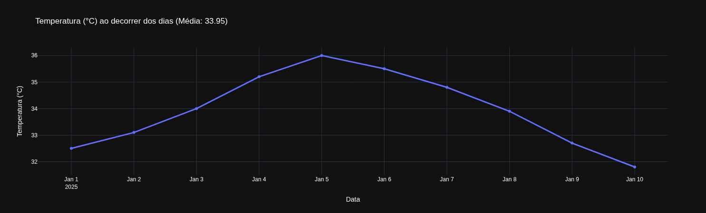
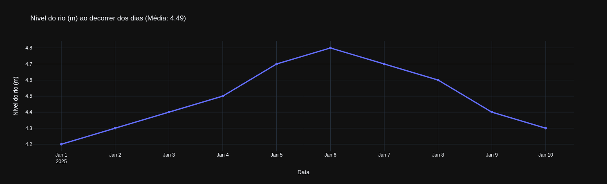
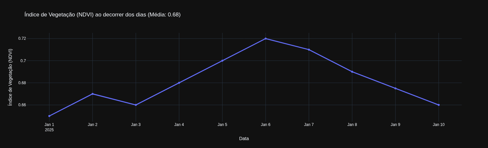

# Dados-Pantanal
Projeto de análise de dados - Desenvolvimento de Plataforma de Dados Ambientais

# 📊 Análise de Dados Ambientais do Pantanal

## Descrição

Este projeto realiza uma análise exploratória de um pequeno conjunto de dados ambientais do Pantanal, contendo informações de temperatura, nível do rio e NDVI ao longo de uma série temporal.

O objetivo do notebook `pantanal.ipynb` é:
- ler os dados fornecidos;
- tratar valores ausentes;
- organizar a base para análise;
- calcular estatísticas básicas;
- gerar visualizações temporais das variáveis.

---

## 📊 Resultados

### 🌡️ Temperatura


### 🌊 Nível do rio


### 🌱 NDVI


---

## 📈 Principais Insights

- A temperatura apresenta crescimento até a metade do período analisado, seguido de queda gradual
- O nível do rio acompanha parcialmente a variação climática
- O NDVI indica uma tendência de aumento da vegetação até determinado ponto, seguido de redução

---

## Estrutura do Projeto

- `dados_pantanal.csv` — arquivo com os dados utilizados na análise
- `pantanal.ipynb` — notebook com o processamento, análise e visualizações
- `README.md` — documentação do projeto

---

## Tecnologias Utilizadas

- Python 3
- Pandas
- Plotly Express

---

## Etapas Realizadas

### 1. Leitura dos dados
A base foi carregada a partir do arquivo `dados_pantanal.csv` usando a biblioteca `pandas`.

### 2. Inspeção inicial
Foi utilizada a função `info()` para verificar os tipos de dados e identificar valores ausentes.

### 3. Tratamento de dados ausentes
A coluna de datas foi convertida para o formato `datetime`, permitindo o uso adequado da série temporal.

Em seguida, foi aplicada **interpolação linear** para preencher os valores ausentes nas colunas numéricas.

### 4. Organização da tabela
As colunas foram renomeadas para nomes mais claros e adequados à visualização:
- `data` → `Data`
- `temperatura_c` → `Temperatura (°C)`
- `nivel_rio_m` → `Nível do rio (m)`
- `ndvi` → `Índice de Vegetação (NDVI)`

### 5. Geração de estatísticas
Foram calculadas as médias das variáveis:
- Temperatura
- Nível do rio
- NDVI

### 6. Visualização dos dados
Foram gerados gráficos de linha com a biblioteca Plotly Express para mostrar a evolução temporal das variáveis ambientais.

Um gráfico inicial foi criado para teste da estrutura, seguido da automação dos gráficos para todas as variáveis.

---

## Justificativa do Tratamento dos Dados

A interpolação linear foi escolhida por se tratar de uma série temporal diária. Esse método permite estimar valores faltantes de forma coerente com a continuidade natural dos dados, sem perda significativa de informação.

---

## Como Executar

1. Instale as dependências:

```bash
pip install pandas plotly

```
2. Abra o notebook:

```bash
jupyter notebook pantanal.ipynb

```

3. Execute as células em ordem ou utilize "Run All"


